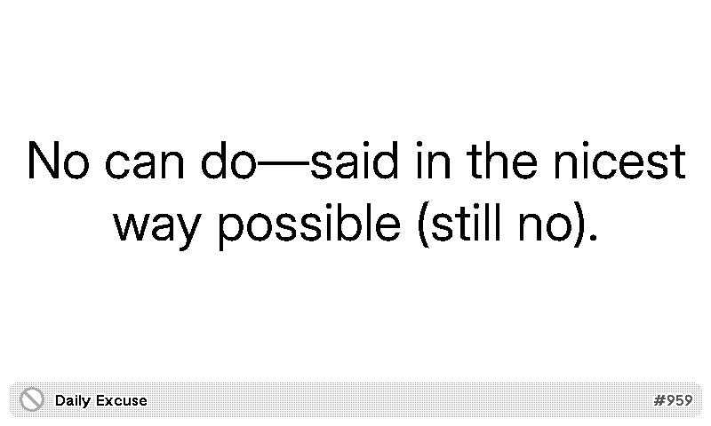

# Daily Excuse

Master the art of saying no — gracefully. A fresh reason to decline, every refresh, courtesy of [No as a Service](https://github.com/hotheadhacker/no-as-a-service). Works great in mashup mode — add up to 4 instances and each one shows a different excuse.

<!-- PLUGIN_STATS_START -->
## 🚀 TRMNL Plugin

*Last updated: 2026-04-22 07:16:14 UTC*

##  [Daily Excuse](https://trmnl.com/recipes/286320)

 

### Description
Random excuses to say no, courtesy of <a href="https://github.com/hotheadhacker/no-as-a-service">No as a Service</a>.

---

<!-- PLUGIN_STATS_END -->
